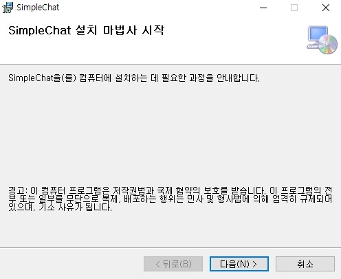
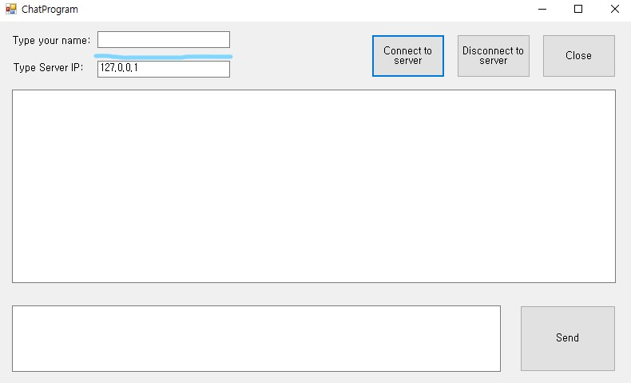
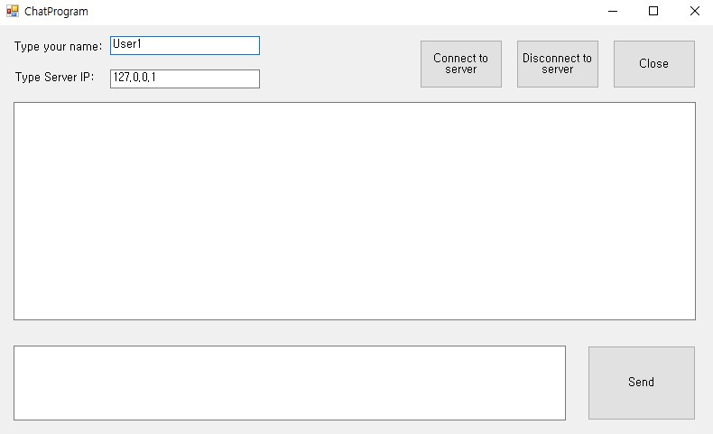
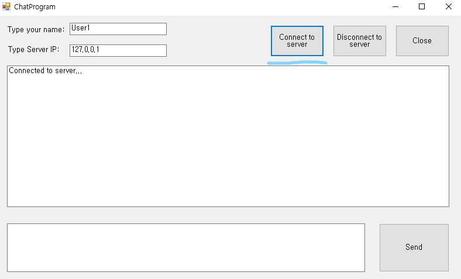

# SimpleChat.NET

## Description
> 2022.05. - 2022.06.

- Simple chat for .NET Framework
- C# .NET을 이용한 채팅 프로그램 작성 프로젝트.

## About Project

### Task Order
- 3단계로 작성.

#### Step1

콘솔 앱(.NET Framework)을 이용한 기본적인 Chatting Program 개발.

- server

- client

참조: [https://stackoverflow.com/questions/43431196/c-sharp-tcp-ip-simple-chat-with-multiple-clients]

#### Step2

전반적인 코드 이해 및 정리.

- server

- client

#### Step3

WinForm을 이용한 Client Chatting Program 개발. 

- server

- client

---------------

### Installation and Usage

1. ChatSetup.zip 폴더 다운로드 및 압축 해제.

2. setup.exe 파일 실행.

3. 설치 진행.

4. 바탕화면 SimpleChat 아이콘 생성 확인 및 실행.

5. Type your name: 칸에 사용자 이름 입력.

6. Connect to server 버튼 클릭.

7. 메시지 입력 후 Send 버튼 클릭.

8. 채팅 종료시 Disconnect to server 버튼 클릭 후 Close.

## Singularity

- System.Net.Sockets 소켓 통신 중 TcpClient 클래스를 이용한 소켓 통신.

- Serialize, Deserialize Object Newtonsoft.Json 사용.